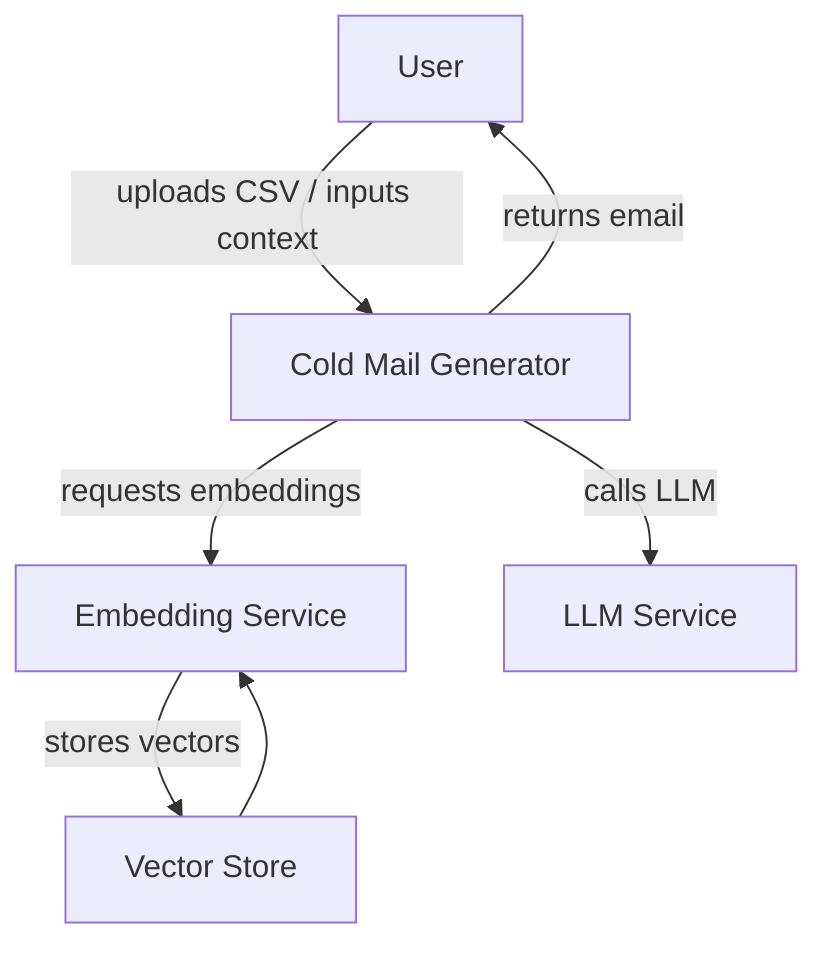
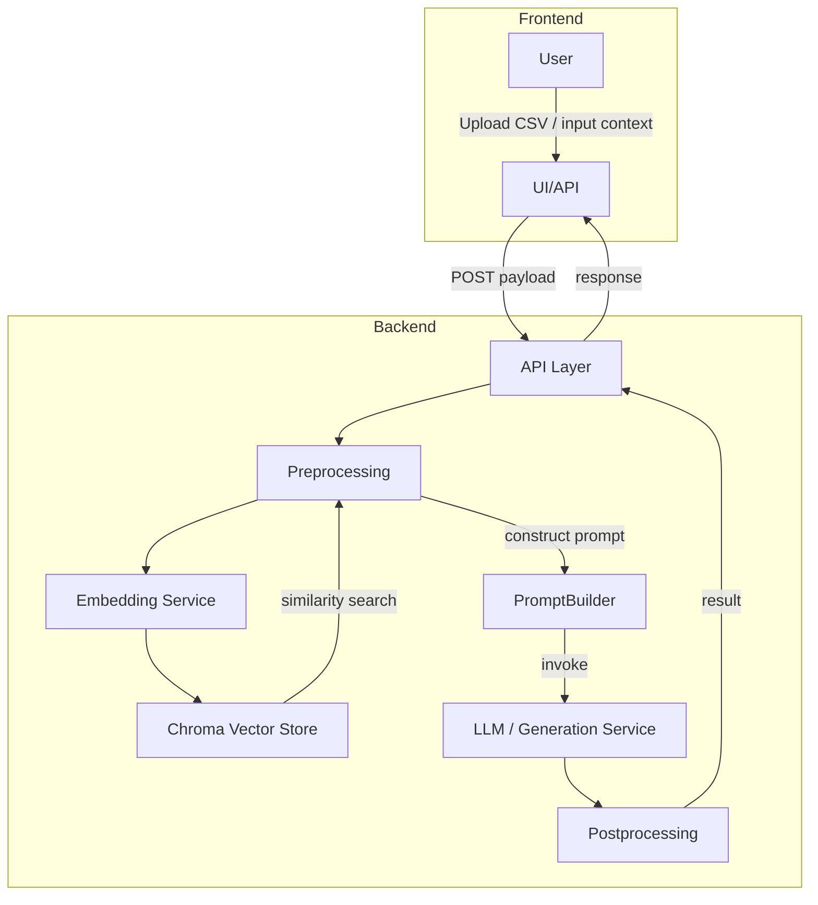
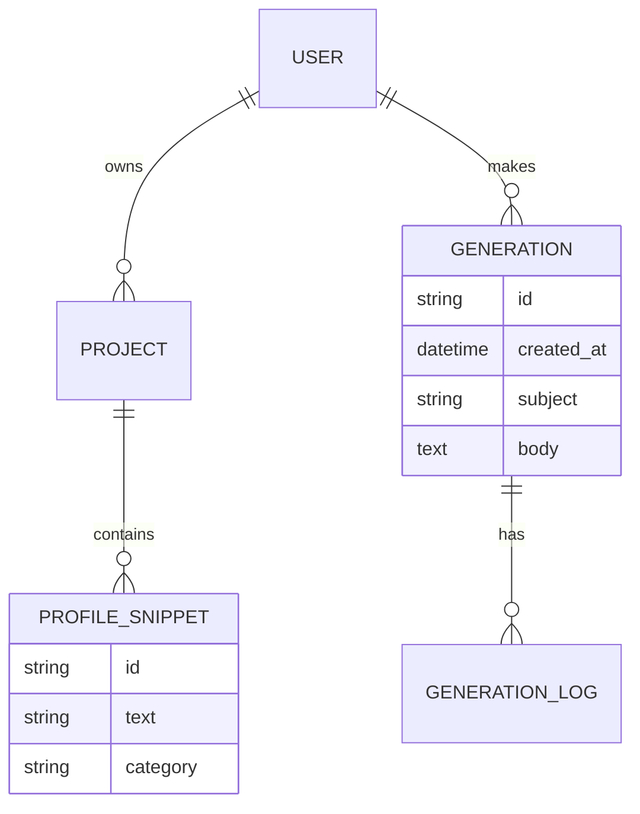

# Cold Mail Generator — Project Synopsis

**Project Title:** Cold Mail Generator

**Author:** (Fill in your name)

**Date:** (Fill in date)

---

**1. Project Overview**

The Cold Mail Generator is an application that automates creation of personalized outreach emails (cold emails) for job-seeking, sales, or outreach campaigns. The system ingests a user-provided portfolio (CSV), optionally external context (company or role descriptions), and uses a text-generation model combined with template logic to produce tailored emails with subject lines and follow-ups.

**Objectives:**
- Generate coherent, personalized cold emails with variable tone and length.
- Allow users to input personal portfolio and target context to increase relevance.
- Provide an easy-to-use API and simple UI for rapid usage.

---

**2. Technologies & Tools**

- Language: Python 3.9+
- Web framework / runner: FastAPI (or minimal Flask, see `app/main.py`)
- Notebooks: Jupyter (.ipynb) for experimentation
- Vector store: ChromaDB (local) for optional semantic retrieval (vectorstore/)
- Model interfaces: OpenAI/GPT-style APIs or local LLMs via LangChain-like wrappers
- Data: CSV (`resource/my_portfolio.csv`) as structured user portfolio
- Storage: SQLite (used by Chroma) for vector persistence
- Dependencies: See `requirements.txt` (typical libs: fastapi, uvicorn, chromadb, pydantic, pandas, transformers, sentence-transformers)

---

**3. High-level Architecture**

- Input: User uploads or points to `my_portfolio.csv` and provides target company/role text.
- Preprocessing: Normalize CSV fields, extract key achievements, create embedding vectors for retrieval.
- Retrieval (optional): Find relevant portfolio snippets via vector similarity to target context.
- Prompt construction: Fill templates with retrieved snippets and portfolio fields; add instructions for desired tone/length.
- Generation: Use an LLM (remote API or local model) to generate subject line and email body.
- Postprocessing: Clean up, check for PII, ensure length limits, and formatting (line breaks, salutations).
- Output: Return email(s) via API and optionally store generation records.

---

**4. Data & Preprocessing**

Data sources:
- Primary: `my_portfolio.csv` (columns: name, title, skills, achievements, summary, linkedin, contact)
- Optional: external company/job description text, scraped pages, or user notes.

Preprocessing steps:
1. Load CSV via `pandas.read_csv`.
2. Normalize case, strip whitespace, and fill missing values.
3. Tokenize text fields for any local embeddings model.
4. Create embeddings (sentence-transformers or API) for each portfolio snippet.
5. Store embeddings in Chroma vector store for retrieval.
6. When target context provided, embed it and run a similarity search to select top-K portfolio snippets.
7. Construct prompt using selected snippets with clear delimiters and instruction blocks.

Quality & safety preprocessing:
- PII filter: remove or redact sensitive fields if requested.
- Length truncation: enforce token/window limits for the chosen LLM.
- Content policy: optional filter to avoid disallowed or harmful content.

---

**5. Models & Prompting Strategy**

Model choices:
- Cloud API (recommended for quality): OpenAI GPT-4/GPT-4o/GPT-3.5; Anthropic Claude; or other hosted LLMs.
- Local models (if offline): Llama 2 / Mistral / LLMs via Hugging Face Transformers; may require quantized runtimes.
- Embeddings: `sentence-transformers/all-MiniLM-L6-v2` or OpenAI embeddings for vector similarity.

Prompting approach:
- Use a template containing: task description, persona (user name, title), target company context, bullet points (top-K snippets), required sections, tone and call-to-action.
- Include explicit format instructions (subject line, salutation, body, CTA, sign-off).
- Add examples or few-shot seeds if helpful for style control.
- Use retrieval-augmented generation (RAG): include retrieved portfolio snippets to ground responses and reduce hallucination.

Example prompt outline:

"""
You are an assistant that writes concise, professional cold outreach emails. Use the profile below and the target company info to craft a 3-paragraph email with a subject line.

Profile:
- Name: {name}
- Title: {title}
- Key achievements: {top_snippets}

Target context:
{company_context}

Tone: friendly, confident, concise. Output format:
Subject: <text>
Email:
<salutation>
<body>
<closing>
"""

Model selection considerations:
- Choose model by required quality vs cost.
- For high-quality personalization, larger models (GPT-4) are preferred.
- For offline deployments, evaluate local LLM token windows and latency.

---

**6. Training & Fine-tuning (Optional)**

This project primarily uses prompting rather than training. If fine-tuning is desired:
- Collect examples of high-quality cold emails and corresponding inputs (profile + company).
- Fine-tune a smaller model or use instruction-tuning approaches.
- Validate on held-out examples for tone, relevance, and safety.

---

**7. Evaluation**

Metrics:
- Human evaluation for personalization, relevance, and professionalism.
- Automated checks: BLEU/ROUGE are poor fits; prefer semantic similarity and classifier-based style checks (e.g., sentiment, tone).
- A/B testing: measure reply rates in real campaigns (real-world metric).

Testing checklist:
- Ensure generated emails contain at least one personalized detail from portfolio.
- Avoid hallucinated facts (e.g., false employer claims).
- Respect token/window limits.

---

**8. Deployment & Integration**

- Run as FastAPI app (`app/main.py`) behind `uvicorn` for simple hosting.
- Optionally package as Docker container.
- For production, integrate secrets management for API keys and rate-limiting.
- Use background tasks for embedding/update operations and cache vectors.

---

**9. File Structure (example)**

- `app/` - application code (main server, chains, utils)
- `resource/my_portfolio.csv` - sample user data
- `vectorstore/` - Chroma DB persistence
- `imgs/` - optional diagram assets
- `PROJECT_SYNOPSIS.md` - (this file)

---

**10. Diagrams**

Below are diagrams included as Mermaid markup so you can paste them into your report or render on GitHub pages that support Mermaid.

**DFD Level 0**



**DFD Level 1**



**ER Diagram (simplified)**



**Use Case Diagram**

```mermaid
%%{init: {"theme":"default"}}%%
  actor User as U
  rectangle System {
    U -- (Upload Portfolio)
    U -- (Enter Target Context)
    U -- (Request Email Generation)
    U -- (Review & Edit Email)
    U -- (Save / Export Email)
  }
```

---

**11. How to include this in your synopsis report**

- Copy the sections from this file into your synopsis document under Project Background, Methodology, Implementation, and Diagrams.
- For diagrams: either paste the Mermaid blocks into a Mermaid-enabled renderer or export them as PNG/SVG using Mermaid Live Editor and include the images in your report.
- Add screenshots from `app/` UI if you implemented one.

---

**12. Next steps & recommendations**
- Add sample campaign evaluation section once you have reply-rate data.
- Add privacy & GDPR considerations if sending real outreach emails.
- Optionally provide a fallback template bank for cold emails specialized to industries (sales, jobs, partnerships).

---

**Appendix: Quick run notes**

- Run server locally:

```
pip install -r requirements.txt
uvicorn app.main:app --reload
```

- Embeddings generation (example snippet):

```python
import pandas as pd
from sentence_transformers import SentenceTransformer
model = SentenceTransformer('all-MiniLM-L6-v2')
df = pd.read_csv('resource/my_portfolio.csv')
embeddings = model.encode(df['summary'].fillna(''), show_progress_bar=True)
```


